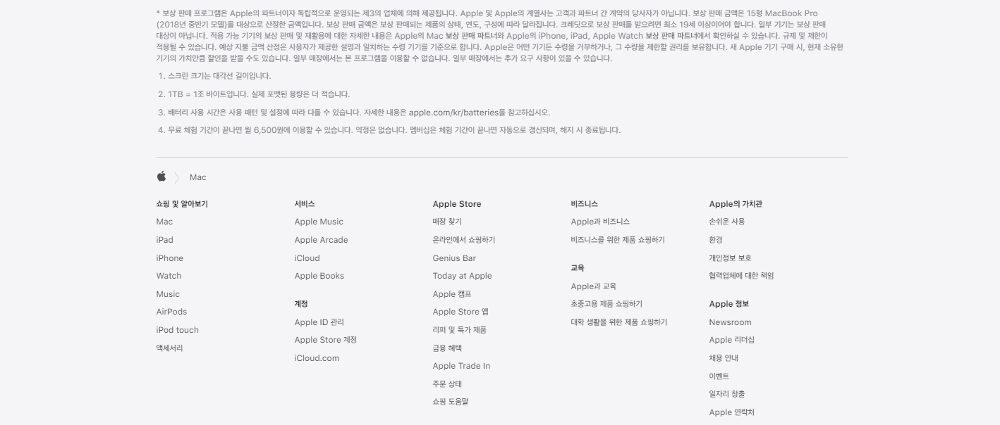

<html>
    <head></head>
    
    <body>
    	

    	

    	

    		

    		

    		

    	

    	

    		

    		

    		

    		

    		

    	

    	

    	

    		

    		

    	

    	

    		

    		

    	

    	<h2 style="clear: both;">Mac을 더욱 Mac답게 만드는 모든 것.</h2>
    	

    	

    		

    		

    	

    	

    	

    	<h2>Mac을 더 잘 활용하는 법</h2>
    	

    	

    		

    		

    	

    	

    	

    </body>
